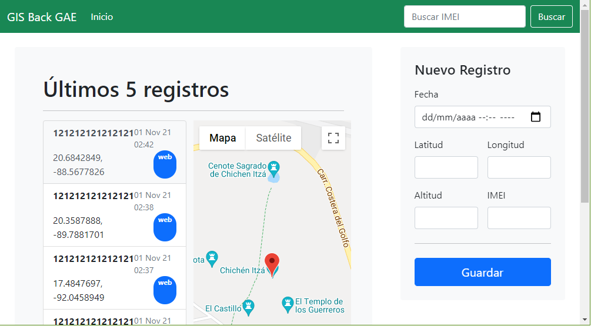

# GISBack

Aplicación sencilla para Google App Engine que almacena
información GPS

El request está simplificado con la intención de reducir
al máximo el tamaño de las peticiones. La idea es utilizar el servicio de backend para
pruebas con dispositivos IoT.

## Requisitos

Para poder desplegar la aplicación se requiere:

- Cuenta Google Cloud con facturación habilitada
- Cloud SDK instalado e inicializado
- API Google Maps Habilitada y api key generada
- API Datastore Habilitada
- API Cloud Build Habilitada

## Despliegue

Primero es necesario clonar el repositorio

``` sh
$ git clone https://github.com/diego-amv/gisback.git
$ cd gisback
```

En el archivo [main.go](main.go) es necesario reemplazar los valores de `ProjectId`
y `MapsAPIKey` por los que corresponde a tu proyecto. Quedaría algo similar a:

``` go
const ProjectId = "id-de-tu-proyecto"
const MapsAPIKey = "apikey-optenida-de-google-maps"
```

El despliegue se hace a través del SDK de Google Cloud
con los siguientes comandos: 

``` sh
$ gcloud beta app deploy --project=<id-de-tu-proyecto> ./app.yaml --quiet
$ gcloud beta app deploy index.yaml --project=<id-de-tu-proyecto> --quiet
```

### Revisar

Para ver los datos registrados ejecuta:

``` sh
$ gcloud app browse --project=<id-de-tu-proyecto>
```

A continuación una captura de pantalla de la UI:



### Registrar Datos

Para registrar datos en el servicio desplegado se puede
hacer directamente en la interfaz o a través de curl.

A continuación un ejemplo del body de un request.

``` json
{
  "c": "data",
  "i": 121212121212121,
  "la": 10.5465465151,
  "lo": 11.1511351515,
  "al": 12,
  "t": "2021-10-31T16:41:10.817Z"
}
```

#### Registro con cURL

Podemos registrar datos con cURL guardando el JSON
anterior en un archivo, por ejemplo ´data.json´, y
ejecutando el comando:

``` sh
$ curl -X POST -H "Content-Type: application/json" -d @data.json https://<id-de-tu-proyecto>.appspot.com/track
```

## Despliegue Local

Para hacer pruebas en local se requiere tener instalado el emulador de datastore y el
SDK de GoLang 1.16+. Además de que en este modo la autenticación no esta habilitada.

### Ejecutar Emulador Datastore

Primer es necesario ejecutar el emulador de Datastore

``` sh
$ gcloud beta emulators datastore start
```

El emulador debe permanecer corriendo para poder ejecutar la aplicación en local. A
continuación establecemos las variables de entorno con el comando para windows:

``` sh
$ gcloud beta emulators datastore env-init > set_vars.cmd && set_vars.cmd
```


### Ejecución Local

Finalmente para ejecutar la aplicación utilizamos los comandos

``` sh
$ git clone https://github.com/diego-amv/gisback.git
$ cd gisback
$ go get
$ go run .
```